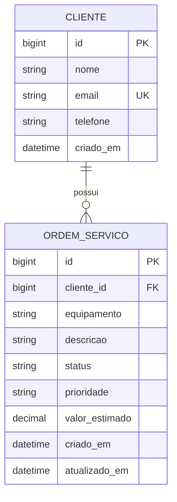

# Assistência Técnica API

Trabalho de **Tópicos Especiais em Software — Desenvolvimento de API RESTful com Django**.

API para cadastrar clientes e acompanhar ordens de serviço de uma assistência técnica. O tema é diferente de controle de biblioteca. O escopo contém duas entidades de negócio, com regras pequenas e demonstráveis.

## Tecnologias

- Python 3.12 (versão usada na validação).
- Django 5.2 LTS, Django REST Framework e SQLite.
- django-filter para filtros; python-dotenv para configuração.
- drf-spectacular para OpenAPI e Swagger UI.
- Versões exatas, incluindo dependências indiretas, em `requirements.txt`.

SQLite acompanha o Python: não é preciso instalar MySQL nem outro servidor.

## Execução rápida nesta máquina

O ambiente local já foi preparado. No PowerShell:

```powershell
cd D:\codigos-pessoais\trab-java-3\Avaliacao-3-Python
.\.venv\Scripts\python.exe manage.py runserver
```

Acesse:

| Recurso | Endereço |
| --- | --- |
| Painel HTML e CSS | http://127.0.0.1:8000/ |
| API navegável do DRF | http://127.0.0.1:8000/api/ |
| Documentação interativa Swagger | http://127.0.0.1:8000/api/docs/ |
| Schema OpenAPI | http://127.0.0.1:8000/api/schema/ |
| Administração Django | http://127.0.0.1:8000/admin/ |

A interface do DRF funciona sem CDN. O Swagger carrega seus arquivos de interface por CDN e precisa de internet no navegador.

## Instalação do zero — Windows

Pré-requisitos: Git e Python 3.12 instalado. A pasta `.venv` é específica de cada máquina e deve ser recriada após clonar.

```powershell
git clone https://github.com/Tavares-Gui/Avaliacao-3-Python.git
cd Avaliacao-3-Python
py -3.12 -m venv .venv
.\.venv\Scripts\python.exe -m pip install -r requirements.txt
.\.venv\Scripts\python.exe scripts\configurar.py
.\.venv\Scripts\python.exe manage.py migrate
.\.venv\Scripts\python.exe manage.py seed_demo
.\.venv\Scripts\python.exe manage.py runserver
```

Não é necessário ativar o ambiente virtual: os comandos usam seu executável diretamente, evitando bloqueios de `Activate.ps1`. Se houver lentidão de certificados no pip desta máquina, use `-m pip install --use-deprecated=legacy-certs --no-cache-dir -r requirements.txt`; a verificação HTTPS continua habilitada.

O script `scripts/configurar.py` cria `.env` com uma chave aleatória e não sobrescreve um arquivo existente. Também é possível copiar `.env.example` manualmente e gerar uma chave com `python -c "import secrets; print(secrets.token_urlsafe(64))"`.

Em Linux/macOS, crie o ambiente com `python3 -m venv .venv` e use `.venv/bin/python` nos comandos seguintes.

### Variáveis de ambiente

| Variável | Finalidade |
| --- | --- |
| `SECRET_KEY` | Chave exclusiva da instalação; obrigatória, sem valor secreto no repositório. |
| `DEBUG` | Ativa diagnóstico local. O exemplo usa `True`; o padrão do código é `False`. |
| `ALLOWED_HOSTS` | Hosts separados por vírgula; o exemplo permite apenas localhost e 127.0.0.1. |
| `DB_NAME` | Nome/caminho do banco SQLite; padrão `db.sqlite3`. |

SQLite não usa credenciais de usuário e senha. Se o banco for trocado por MySQL no futuro, suas credenciais também deverão vir do ambiente. Variáveis já definidas no sistema têm precedência sobre `.env`.

A API é **pública para demonstração local** (`AllowAny`). Não há autenticação de clientes, JWT ou controle de permissões por registro. Não publique como serviço de produção sem acrescentar esses controles e configurar HTTPS. O painel administrativo usa autenticação própria do Django.

### Dados e administração

`seed_demo` cria três clientes fictícios e doze ordens: isso permite demonstrar duas páginas, filtros e todos os status. Pode ser repetido sem duplicar os dados de demonstração que ainda existem e sem sobrescrever edições. Não apaga dados anteriores; não garante uma quantidade fixa se você tiver alterado os identificadores usados pelo comando.

Para criar um usuário do painel administrativo:

```powershell
.\.venv\Scripts\python.exe manage.py createsuperuser
```

Nenhuma senha padrão está embutida no projeto.

## Modelagem



- Um cliente pode ter zero ou várias ordens. Cada ordem pertence a exatamente um cliente.
- `ForeignKey(..., on_delete=PROTECT)` impede excluir um cliente com ordens vinculadas. A API retorna `400`, com uma explicação. Remova ou transfira as ordens antes de excluir o cliente.
- Excluir uma ordem não exclui o cliente.
- E-mail único, sem distinguir maiúsculas e minúsculas; a API o armazena em minúsculas.
- Telefone: 10 ou 11 dígitos, incluindo DDD, sem espaços ou pontuação.
- Valor estimado: de `0.00` a `99999999.99`, no máximo duas casas decimais. Representa um orçamento, não um pagamento realizado.
- Status: `aberta`, `em_andamento`, `concluida`, `cancelada`.
- Prioridade: `baixa`, `normal`, `alta`.
- Qualquer mudança entre os status válidos é permitida. Não há fluxo obrigatório de transições.
- Identificadores e datas são somente de leitura.
- Validações dos serializers dão erros compreensíveis; constraints no banco reforçam unicidade, valor não negativo e escolhas válidas.

## Endpoints e códigos HTTP

As rotas terminam com `/`. Envie JSON com `Content-Type: application/json`.

| Método | Clientes | Ordens | Sucesso |
| --- | --- | --- | --- |
| GET | `/api/clientes/` | `/api/ordens/` | 200, lista paginada |
| GET | `/api/clientes/{id}/` | `/api/ordens/{id}/` | 200, detalhe com relacionamento |
| POST | `/api/clientes/` | `/api/ordens/` | 201 |
| PUT | `/api/clientes/{id}/` | `/api/ordens/{id}/` | 200 |
| PATCH | `/api/clientes/{id}/` | `/api/ordens/{id}/` | 200 |
| DELETE | `/api/clientes/{id}/` | `/api/ordens/{id}/` | 204, corpo vazio |

Erros esperados: `400` para payload/JSON/filtros tipados inválidos e exclusão protegida; `404` para recurso ou página inexistente; `405` para método não permitido. Falhas imprevistas retornam `500` e mensagem genérica, com detalhes registrados no servidor. Não existe uma rota que cause erro 500 deliberadamente; esse comportamento é testado com uma falha simulada.

### POST de cliente

```json
{
  "nome": "Marina Souza",
  "email": "marina@example.com",
  "telefone": "11987654321"
}
```

### POST de ordem

Use em `cliente_id` o ID retornado no cadastro do cliente:

```json
{
  "cliente_id": 1,
  "equipamento": "Notebook",
  "descricao": "Equipamento desliga após alguns minutos de uso.",
  "status": "aberta",
  "prioridade": "normal",
  "valor_estimado": "180.00"
}
```

Na resposta, `cliente_id` dá lugar a um objeto `cliente` com ID, nome, e-mail e telefone. O ID é usado na escrita; o serializer aninhado é usado na leitura. `GET /api/clientes/{id}/` inclui `ordens` resumidas, sem aninhar novamente o cliente.

**PUT exige todos os campos editáveis**, com o mesmo formato dos POSTs acima. Omitir um deles resulta em `400`, mesmo quando o model tem um valor padrão. **PATCH exige somente os campos alterados**, por exemplo `{"status": "em_andamento"}`. Campos somente de leitura são ignorados na entrada, conforme o comportamento padrão do DRF.

### Paginação, filtros, busca e ordenação

Há dez registros por página, no formato `count`, `next`, `previous` e `results`. O detalhe de cliente inclui todas as ordens vinculadas, sem paginação interna; o endpoint de ordens é a opção paginada.

| Exemplo | Resultado |
| --- | --- |
| `/api/clientes/?page=2` | Segunda página |
| `/api/clientes/?nome=ana` | Nome contém “ana”, sem distinguir caixa |
| `/api/clientes/?email=ana.demo@example.com` | E-mail exato, sem distinguir caixa |
| `/api/clientes/?search=bruno` | Busca em nome/e-mail |
| `/api/clientes/?ordering=-nome` | Nome em ordem decrescente |
| `/api/ordens/?status=aberta&prioridade=alta` | Filtros combinados |
| `/api/ordens/?cliente=1` | Ordens do cliente informado |
| `/api/ordens/?search=Notebook` | Busca em equipamento, descrição e nome do cliente |
| `/api/ordens/?ordering=-valor_estimado` | Maior orçamento primeiro |

Ordenação de clientes: `nome`, `criado_em`, `id`. De ordens: `criado_em`, `valor_estimado`, `id`. Use `-` para decrescente e vírgula para combinar campos. Parâmetros desconhecidos e campos de ordenação não autorizados são ignorados pelo DRF/django-filter; valores inválidos dos filtros de cliente, status e prioridade retornam `400`.

### Bônus: resumo gerencial

`GET /api/ordens/resumo/` retorna a quantidade total, contagem por status e soma dos valores estimados. Aceita os mesmos filtros e busca da listagem e considera todos os resultados, não somente uma página.

```json
{
  "total": 0,
  "por_status": {"aberta": 0, "em_andamento": 0, "concluida": 0, "cancelada": 0},
  "valor_total_estimado": "0.00"
}
```

A soma inclui todos os status selecionados, inclusive canceladas; não representa faturamento. Para somar só ordens concluídas, use `?status=concluida`.

## Interface HTML e CSS (Bancada)

Abra **http://127.0.0.1:8000/** após iniciar o servidor com o mesmo comando `manage.py runserver`. Não há build, npm, JavaScript, CDN ou dependência nova para o painel. Se usar outra porta no servidor, use a mesma porta no navegador.

O painel oferece clientes e ordens, criação, edição completa, alteração parcial, exclusão com confirmação, consulta por ID, relacionamentos, busca, filtros de status, ordenação e paginação. O resumo no topo sempre considera todas as ordens, independentemente dos filtros da tabela.

- **Novo cadastro:** envia POST à API.
- **Abrir:** consulta o detalhe com GET e preenche o formulário.
- **Salvar alterações:** envia todos os campos editáveis com PUT.
- **Alterar apenas o status/telefone:** envia um campo com PATCH.
- **Excluir:** abre uma confirmação; somente o botão “Confirmar exclusão” envia DELETE.
- **Consultar pelo ID:** permite demonstrar GET 200 e 404.
- O painel da última requisição mostra método, rota e **status real da API**, além do JSON em “Ver resposta da API”.
- Erros de validação aparecem junto aos campos e as entradas são preservadas.
- Atualizar a página após salvar não reenvia o formulário.

### Como funciona sem JavaScript?

O navegador envia formulários HTML ao Django. A view `assistencia/painel.py` usa `urllib.request` (biblioteca padrão do Python) para chamar os endpoints reais da API no mesmo host/porta. O DRF continua responsável pelas validações e pela persistência.

```text
Formulário HTML -> view do painel -> HTTP para /api/ -> DRF -> SQLite
                                     resposta JSON/status
                   <- sessão e redirecionamento <-
Navegador <- página HTML com resultado
```

Formulários HTML comuns só enviam GET ou POST; quem envia PUT, PATCH e DELETE à API é o Python no servidor. Por isso, a navegação do formulário responde com redirecionamento 302 e depois uma página 200, enquanto o painel mostra o código da chamada interna à API (201, 400, 204 etc.). O terminal também registra essa chamada.

Os formulários têm proteção CSRF e o template escapa o texto inserido pelos usuários. `novalidate` permite que entradas incorretas cheguem ao serializer, para demonstrar os erros reais da API. O resultado fica temporariamente na sessão para usar o padrão POST/Redirect/GET, evitando cadastros duplicados por atualização de página.

Use o `runserver` normal, **sem `--nothreading`**: ele precisa atender a página e a chamada à API simultaneamente. A interface foi preparada para a demonstração local; em produção, esse consumo interno exigiria configuração de concorrência e implantação adequada. Se não houver resposta, aparece “Sem conexão”, sem inventar um código HTTP.

Arquivos da interface:
- `assistencia/painel.py`: recebe formulários e chama a API.
- `assistencia/templates/assistencia/painel.html`: estrutura e formulários.
- `assistencia/static/assistencia/painel.css`: aparência e adaptação de layout.
- `config/urls.py`: página inicial.
- `assistencia/tests/test_painel.py`: testes dos formulários contra uma API real, em servidor/banco de testes descartáveis.

## Testes e verificações

```powershell
.\.venv\Scripts\python.exe manage.py check
.\.venv\Scripts\python.exe manage.py makemigrations --check --dry-run
.\.venv\Scripts\python.exe manage.py test
.\.venv\Scripts\python.exe manage.py spectacular --validate --fail-on-warn --file schema.yaml
```

O último comando gera um arquivo opcional de documentação. O teste usa banco separado e descartável; não apaga o SQLite local. A suíte cobre CRUD, relacionamentos, PUT/PATCH, validações, integridade, filtros, paginação, resumo, falhas HTTP e repetição do seed. Um teste verifica que a listagem com clientes aninhados evita consultas repetidas por ordem.

O GitHub Actions repete as verificações em Python 3.12 após o código ser enviado ao GitHub. Esse workflow não substitui a demonstração presencial.

Para alterar os models: edite o código, execute `manage.py makemigrations`, revise e versione a migração criada e aplique com `manage.py migrate`. Em um clone novo, as migrações já versionadas são aplicadas com `migrate`.

## Estrutura para estudar

```text
config/                      Configurações e roteamento principal
assistencia/
  models.py                  Entidades, relacionamento e constraints
  serializers.py             JSON, validação e leitura aninhada
  views.py                   ModelViewSets e ação de resumo
  urls.py                    DefaultRouter
  filters.py                 Filtros declarativos
  exceptions.py              Respostas de erros
  admin.py                   Administração
  migrations/                Histórico versionado do banco
  management/commands/       seed_demo
  tests/                     Testes automatizados
scripts/configurar.py        Geração segura do .env local
docs/DEFESA.md               Roteiro e perguntas técnicas
docs/Assistencia.postman_collection.json
.github/workflows/tests.yml  Verificação automática no GitHub
```

## Conferência do enunciado

| Exigência | Onde demonstrar |
| --- | --- |
| Tema diferente de biblioteca | Clientes e ordens de assistência técnica |
| Django + DRF e app modular | `config/` e `assistencia/` |
| ORM e banco relacional | `models.py`, SQLite em `settings.py` |
| Duas entidades relacionadas | `Cliente` e `OrdemServico.cliente` |
| Migrações nativas | `assistencia/migrations/` |
| GET, POST, PUT, PATCH, DELETE para ambas | Dois `ModelViewSet` registrados no `DefaultRouter` |
| Paginação e filtros | Configuração global, `filters.py` |
| Detalhes aninhados sem ciclos | Serializers de detalhe/resumo |
| ModelSerializer e validação | `serializers.py` |
| 200, 201, 204, 400, 404, 500 | Suíte em `assistencia/tests/test_api.py` |
| Integridade referencial | `PROTECT` e tratamento de `ProtectedError` |
| Segredos e DEBUG no ambiente | `.env.example`, `settings.py`, `configurar.py` |
| .gitignore, dependências e instruções | Arquivos da raiz |

Bônus de escopo controlado: Swagger/OpenAPI, resumo com agregações ORM, busca e ordenação, Django Admin, dados fictícios, testes, otimização de consultas e CI.

## Defesa e entrega

Leia [o roteiro da defesa](docs/DEFESA.md). Importe [a coleção do Postman](docs/Assistencia.postman_collection.json) e execute as requisições em ordem: os IDs são capturados automaticamente. Ela cria seus próprios dados de demonstração e os remove no final; não execute sobre dados reais.

O enunciado pede o link do repositório no BlackBoard, até **19h do dia da defesa**, e informa que commits posteriores ao horário não serão considerados. A data da defesa não está especificada no PDF. Antes de enviar, confira se o código e as migrações foram publicados no repositório e se a equipe sabe executar a API em outra máquina.

Arquivos `.env`, `db.sqlite3`, `.venv/` e `__pycache__/` não devem ir ao GitHub.

## Referências oficiais

- [Django 5.2](https://docs.djangoproject.com/en/5.2/)
- [DRF: ModelViewSet](https://www.django-rest-framework.org/api-guide/viewsets/)
- [DRF: roteadores](https://www.django-rest-framework.org/api-guide/routers/)
- [DRF: filtros](https://www.django-rest-framework.org/api-guide/filtering/)
